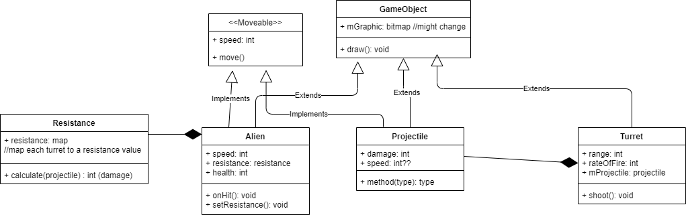

# Tower-Defense-Game
<b>Intitial Tasks due by March 25</b>

<b>Goal:</b> Get the game working with a single enemy & tower type with simple (non-animated) movement and straight paths.
 
<b>In the Professor's words:</b>
> You should spend some time deciding on your class hierarchy and structure. You will supply
simple CRC cards (or a reasonable facsimile) of your design. The majority of the
requirements are outlined below. For this first version you only need implement the most
basic enemy and tower type. Towers are fixed, and enemies follow a basic movement
strategy along the path. No animation is required for enemies or towers.

<b>Tasks:</b>
* [ ] Make a bitmap storage class so only one bitmap is used (see page 606 of packt book).
* [ ] Make 3 "good" levels with increasing difficulty.
* [x] Make the aliens give different amounts of cash based on how strong they are.
* [x] Add more waves of enemies.
* [x] Finish art for aliens.
* [x] Make new art for towers.
* [ ] Add a rules to the game.
* [ ] Clean up GameWorld class.
* [ ] HUD class has a lot of variables, find a better way of dealing with this.
* [ ] GameObjectFactory??? Make a factory pattern for all the gameobjects rather than several different factory patterns.
* [x] Make resistances adaptive and have them change each wave.
* [x] Make resistances work rather than just be ornamental.
* [ ] Once the towers and aliens are done, spend some time balancing the game, not too hard, but a new player shouldn't win on their first try.

<b>Finished Tasks:</b>
* [x] Make a new background with a path.
* [x] Make towers turn without moving.
* [x] Add sound using a sound strategy.
* [x] Add a place for the rules so players can read them.
* [x] Add start screen (with level selection, rules, ect)
* [x] Add a level selection (page 660 of paktbook)
* [x] Keep towers from being placed on top of each other.
* [x] Show tower stats before placing (cancel placement button in lower right?)
* [x] Have the aliens follow the path.
* [x] Add a button to speed up the game.
* [x] Develop initial class hierarchy and control structure.
* [x] Implement "GameWorld" which holds a collection of game objects and other state variables
* [x] Implement a top-level Game class to manage the flow of controling the game (touch, manipulate data, etc)
* [x] Implement a GameView class which will assume the responsibility of displaying information about the state of the game (Quinn)
* [x] Implement abstract GameObject (implement fixed & moveable interfaces for different types (Quinn)
* [x] Implement a single tower type. Not rotational and with a fixed location and cost.
* [x] Implement a single enemy type. That follows a basic movement strategy (Quinn)
* [x] Implement a simple GUI that holds basic game info. In addition, tower selection is done here. We will not use buttons but simply rectangular regions 
* [x] Check up on FPS (FPS should be at 30, but seems to be running much higher, usually around the 50's)
* [x] Keep towers from being placed on the path or on the base.
* [x] Create CRC cards.
* [x] Allow towers to be upgraded.
* [x] Show tower data when selected.
* [x] Calculate damage upon being hit by a projectile, rather than when the projectile is fired. Note this is a big project and probally require some careful thought and discussion.

<b>Known Bugs:</b>

<b>Notes:</b>
* Enemies must implement various strategies, I.E. movement and/or attack strategies.
* Enemies will be constructed using a factory pattern. A strategy will be chosen during this initial construction, and other properties set.
* All game objects have an attribute size. The size can be retrieved (getter) but can be changed once created.
* All game objects have a location (x, y point) as the center of the object. GameObjects location can be retrieved (getter) and/or set (setter). Unless explicitly stated that a location cannot be changed once created.
* GameObjects that implement the movable interface must have integer attributes for heading and speed. Telling an object to move() causes the object to move based on this information. All objects use their strategy to move. Heading is specified by a compass angle in degrees (90 = east, 0 = north).
* No animation is required for this first part of the assignment.
* The game world does not need to extend pass the visible display for the first part of the assignment.
* The "gameMap" consists of a background image with pre-defined paths for enemies.
* Towers are bought using an in-game currency or resource.
* The player can pause and resume the game.
* The player will be presented with a win/loss message when appropriate.

<b>For documentation purposes:<b> 
https://docs.google.com/document/d/1jzjNmYaw-pGcg-SYwLC3hfwqSHZ0u_GVHPIjyIMxmWo/edit?usp=sharing
 
<b>Friday Report:<b> 
https://docs.google.com/document/d/1TSupbw9Hd_TAnXFZTY03NKdHLTAj-OMv-aI7SMWg1d4/edit?usp=sharing
  
 <b>Monday Reports:<b> 
https://docs.google.com/document/d/1br4GeKOxJJSdTLnf_GR609Gh7VzEDjNKywmE7VS0D28/edit?usp=sharing
  
 <b>Final Report<b> 
https://docs.google.com/document/d/15aFICkX8C-BrtC_9eMwqSW-j88pc3l-4XJjuNPo4J-8/edit?usp=sharing  
  
 <b>For clarifying hierarchy:<b> 
 
see Image folder for uml diagram
